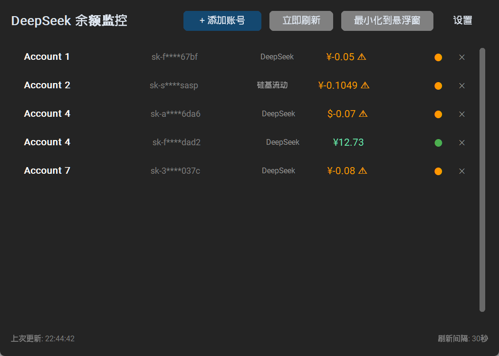

<div align="center">


# DeepSeek Balance Monitor

**多平台 AI API 余额桌面监控 · 悬浮窗实时看板**

[](https://github.com/micc99/deepseek-balance-monitor/releases)
[](#)
[](LICENSE)
[](#)
[](https://github.com/micc99/deepseek-balance-monitor/stargazers)

</div>

---

## 📸 预览

> 💡 点击下方展开查看界面截图（建议将截图保存到 `assets/screenshots/` 目录）

<details>
<summary><b>🖥️ 主窗口</b></summary>
<br>

<!-- 将截图放到 assets/screenshots/ 目录，然后取消下方注释 -->
<!--  -->


</details>

<details>
<summary><b>💬 桌面悬浮窗</b></summary>
<br>

<!--  -->


</details>


---

## ✨ 功能亮点

| 🎯 功能 | 说明 |
|---------|------|
| **多平台聚合** | 一键管理 DeepSeek、硅基流动、Kimi、OpenRouter、智谱 AI 五大平台余额 |
| **桌面悬浮窗** | 最小化后自动切换为悬浮小窗，随时查看余额，不占屏幕空间 |
| **定时自动刷新** | 可配置刷新间隔（最短 10 秒），余额变化实时感知 |
| **系统托盘驻留** | 关闭窗口后仍在托盘运行，右键菜单快速唤起 |
| **开机自启动** | 支持注册 Windows 启动项，开机自动后台监控 |
| **深色 / 浅色主题** | 内置两种 UI 主题，一键切换 |
| **波纹动画** | 鼠标点击自带水波纹特效，颜色可自定义 |
| **多实例互斥** | 自动检测已有实例，防止重复启动 |

---

## 🌐 支持的 AI 平台

| Provider | 平台 | API 端点 |
|----------|------|----------|
|  | 深度求索官方 | `api.deepseek.com` |
|  | 第三方聚合平台 | `api.siliconflow.cn` |
|  | 月之暗面官方 | `api.moonshot.cn` |
|  | 国际聚合平台 | `openrouter.ai/api` |
|  | 智谱华章官方 | `open.bigmodel.cn` |

---

## 🚀 快速开始

### 方式一：下载打包版（推荐）

从 [Releases](https://github.com/micc99/deepseek-balance-monitor/releases) 下载最新 `DeepSeekBalanceMonitor.exe`，双击即可运行，无需安装 Python。

### 方式二：源码运行

**环境要求：** Python **3.10** 或更高版本

```bash
git clone https://github.com/micc99/deepseek-balance-monitor.git
cd deepseek-balance-monitor
pip install -r requirements.txt
python main.py
```

---

## 📖 使用指南

1. **启动程序** — 首次运行后会打开主窗口
2. **添加账号** — 点击「添加」按钮，选择平台、填入 API Key 和备注
3. **查看余额** — 程序自动拉取所有账号余额，主窗口列表展示
4. **切换到悬浮窗** — 关闭主窗口或点击「最小化到悬浮窗」
5. **回到主窗口** — 双击悬浮窗 / 托盘右键 →「显示主窗口」
6. **调整设置** — 刷新间隔、主题、动画颜色均可在设置中修改

---

## 🔧 构建打包

```bash
pip install pyinstaller
pyinstaller --onefile --windowed --icon=deepseek-balance-monitor.ico --name "DeepSeekBalanceMonitor" main.py
```

打包产物位于 `dist/DeepSeekBalanceMonitor.exe`。

> CI 自动构建：推送 `v*` 标签后 GitHub Actions 自动构建并发布 Release。

---

## 🧱 技术栈

```
┌─────────────┐  ┌───────────┐  ┌───────────────┐
│ customtkinte│  │   Pillow  │  │    pystray    │
│   UI 框架   │  │  图标渲染  │  │   系统托盘    │
└──────┬──────┘  └─────┬─────┘  └───────┬───────┘
       └───────────────┼────────────────┘
                       ▼
              ┌─────────────────┐
              │    requests     │
              │  HTTP 余额查询   │
              └────────┬────────┘
                       │
        ┌──────────────┼──────────────┐
        ▼              ▼              ▼
   DeepSeek API   SiliconFlow    Moonshot …
```

- **[customtkinter](https://github.com/TomSchimansky/CustomTkinter)** — 现代化 Tkinter UI 框架
- **[pystray](https://github.com/moses-palmer/pystray)** — 跨平台系统托盘
- **[Pillow](https://python-pillow.org/)** — 图标与图像处理
- **[requests](https://requests.readthedocs.io/)** — HTTP API 调用

---

## 📁 项目结构

```
deepseek-balance-monitor/
├── main.py              # 程序入口 & 应用生命周期
├── main_window.py       # 主窗口 UI
├── floating_window.py   # 桌面悬浮窗
├── balance_checker.py   # 各平台余额查询 Provider
├── scheduler.py         # 定时刷新调度器
├── config.py            # 配置读写 & 数据模型
├── animations.py        # 波纹动画特效
├── instance_lock.py     # 单实例互斥锁
├── config.json          # 用户配置文件（运行时生成）
├── requirements.txt     # Python 依赖
├── assets/
│   └── icon.png         # 应用图标
├── .github/workflows/
│   └── release.yml      # CI/CD 自动构建
└── README.md
```

---

## 🤝 贡献

欢迎提交 Issue 和 Pull Request！

1. Fork 本仓库
2. 创建特性分支 (`git checkout -b feature/amazing-feature`)
3. 提交改动 (`git commit -m 'Add amazing feature'`)
4. 推送到分支 (`git push origin feature/amazing-feature`)
5. 打开 Pull Request

---

## 👤 作者

<p align="center">
  <a href="https://github.com/micc99">
    
  </a>
</p>

<p align="center">
  <sub>更多项目请访问 <a href="https://github.com/micc99">micc99 的主页</a></sub>
</p>

---

## 📜 许可证

本项目基于 [MIT License](LICENSE) 开源。
