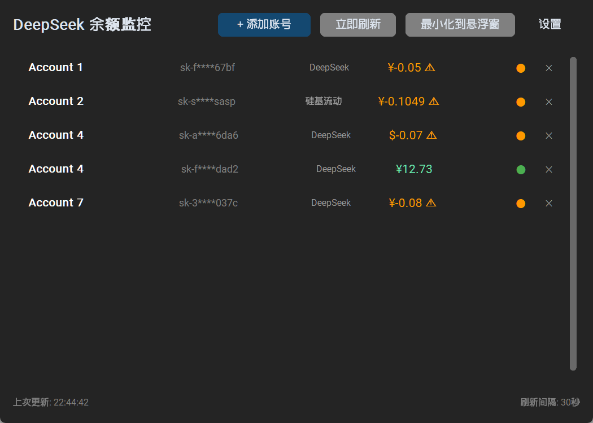

<div align="center">


# DeepSeek Balance Monitor

**多平台 AI API 余额桌面监控 · 悬浮窗实时看板**

[](https://github.com/micc99/deepseek-balance-monitor/releases)
[](#)
[](LICENSE)
[](#)
[](https://github.com/micc99/deepseek-balance-monitor/stargazers)

</div>

---

## 📸 预览

> 💡 点击下方展开查看界面截图

<details>
<summary><b>🖥️ 主窗口</b></summary>
<br>



</details>

<details>
<summary><b>💬 桌面悬浮窗</b></summary>
<br>


</details>


---

## ✨ 功能亮点

| 🎯 功能 | 说明 |
|---------|------|
| **多平台聚合** | 一键管理 DeepSeek、硅基流动、Kimi、OpenRouter、智谱 AI 五大平台余额 |
| **桌面悬浮窗** | 最小化后自动切换为悬浮小窗，随时查看余额，不占屏幕空间 |
| **定时自动刷新** | 可配置刷新间隔（最短 10 秒），余额变化实时感知 |
| **系统托盘驻留** | 关闭窗口后仍在托盘运行，右键菜单快速唤起 |
| **开机自启动** | 支持注册 Windows 启动项，开机自动后台监控 |
| **莫奈主题** | 睡莲/日出印象/干草垛 3 套莫奈主题 + 自定义种子色派生（WCAG AA 校验） |
| **多实例互斥** | 自动检测已有实例，防止重复启动 |

---

## 🌐 支持的 AI 平台

| Provider | 平台 | API 端点 |
|----------|------|----------|
|  | 深度求索官方 | `api.deepseek.com` |
|  | 第三方聚合平台 | `api.siliconflow.cn` |
|  | 月之暗面官方 | `api.moonshot.cn` |
|  | 国际聚合平台 | `openrouter.ai/api` |
|  | 智谱华章官方 | `open.bigmodel.cn` |

---

## 🚀 快速开始

### 方式一：下载打包版（推荐）

从 [Releases](https://github.com/micc99/deepseek-balance-monitor/releases) 下载最新 `DeepSeekBalanceMonitor.exe`，双击即可运行，无需安装 Python。

### 方式二：源码运行

**环境要求：** Python **3.10** 或更高版本

```bash
git clone https://github.com/micc99/deepseek-balance-monitor.git
cd deepseek-balance-monitor
pip install -r main/requirements.txt
python main/main.py
```

---

## 📖 使用指南

1. **启动程序** — 首次运行后会打开主窗口
2. **添加账号** — 点击「添加」按钮，选择平台、填入 API Key 和备注
3. **查看余额** — 程序自动拉取所有账号余额，主窗口列表展示
4. **切换到悬浮窗** — 关闭主窗口或点击「最小化到悬浮窗」
5. **回到主窗口** — 双击悬浮窗 / 托盘右键 →「显示主窗口」
6. **调整设置** — 刷新间隔、主题、动画颜色均可在设置中修改

---

## 🔧 构建打包

```bash
pip install pyinstaller
pyinstaller --onedir --windowed --icon=main/deepseek-balance-monitor.ico --name "DeepSeekBalanceMonitor" --add-data "main/themes;themes" main/main.py
```

打包产物位于 `dist/DeepSeekBalanceMonitor.exe`。

> CI 自动构建：推送 `v*` 标签后 GitHub Actions 自动构建并发布 Release。

---

## 🧱 技术栈

```
┌─────────────┐  ┌────────────┐  ┌────────────────────┐
│   PySide6   │  │ pyqtgraph  │  │ QSystemTrayIcon    │
│  Qt 6 UI    │  │  图表      │  │  系统托盘          │
└──────┬──────┘  └─────┬──────┘  └─────────┬──────────┘
       └───────────────┼───────────────────┘
                       ▼
              ┌─────────────────┐
              │    requests     │
              │  HTTP 余额查询   │
              └────────┬────────┘
                       │
        ┌──────────────┼──────────────┐
        ▼              ▼              ▼
   DeepSeek API   SiliconFlow    Moonshot …
```

- **[PySide6](https://doc.qt.io/qtforpython/)** — Qt 6 官方 Python 绑定（LGPL，UI 框架）
- **[pyqtgraph](https://pyqtgraph.readthedocs.io/)** — 高性能 Qt 图表（余额趋势/用量柱状图）
- **[pynput](https://pynput.readthedocs.io/)** — 全局热键
- **[requests](https://requests.readthedocs.io/)** — HTTP API 调用

---

## 📁 项目结构

```
deepseek-balance-monitor/
├── main/                    # 应用主包（flat import）
│   ├── main.py              # 程序入口 & App 编排器
│   ├── main_window.py       # Qt 主窗口
│   ├── floating_window.py   # 桌面悬浮窗（无边框置顶）
│   ├── settings_dialog.py   # 设置对话框
│   ├── edit_account_dialog.py
│   ├── account_row.py       # 账户行组件
│   ├── usage_curve_window.py   # 余额趋势图（pyqtgraph）
│   ├── usage_bar_window.py     # 用量概览图（pyqtgraph）
│   ├── balance_checker.py   # 各平台余额查询 Provider
│   ├── scheduler.py         # 定时刷新调度器
│   ├── config.py            # 配置读写（原子写+滚动备份）
│   ├── event_bus.py         # 应用事件总线
│   ├── theme_models.py      # 主题数据模型
│   ├── theme_manager.py     # 主题管理器
│   ├── theme_palette.py     # 种子色派生 + WCAG 对比度
│   ├── qss.py               # 主题 token → QSS 渲染
│   ├── qt_bridge.py         # 跨线程 UI 调度桥
│   ├── usage_history.py     # SQLite 用量历史（WAL）
│   ├── usage_proxy.py       # 本地用量代理（127.0.0.1:52848）
│   ├── credential_store.py  # API Key DPAPI 加密
│   ├── mcp_server.py        # 独立 MCP 接口（FastMCP, stdio）
│   ├── managers/            # App 拆分的 8 个职责 Manager
│   ├── themes/              # 内置莫奈主题 JSON（3 套×亮暗）
│   └── requirements.txt     # Python 依赖
├── assets/                  # 应用图标
├── .github/workflows/       # CI/CD 自动构建
└── README.md
```

---

## 🤝 贡献

欢迎提交 Issue 和 Pull Request！

1. Fork 本仓库
2. 创建特性分支 (`git checkout -b feature/amazing-feature`)
3. 提交改动 (`git commit -m 'Add amazing feature'`)
4. 推送到分支 (`git push origin feature/amazing-feature`)
5. 打开 Pull Request

---

## 👤 作者

<p align="center">
  <a href="https://github.com/micc99">
    
  </a>
</p>

<p align="center">
  <sub>更多项目请访问 <a href="https://github.com/micc99">micc99 的主页</a></sub>
</p>

---

## 📜 许可证

本项目基于 [MIT License](LICENSE) 开源。
